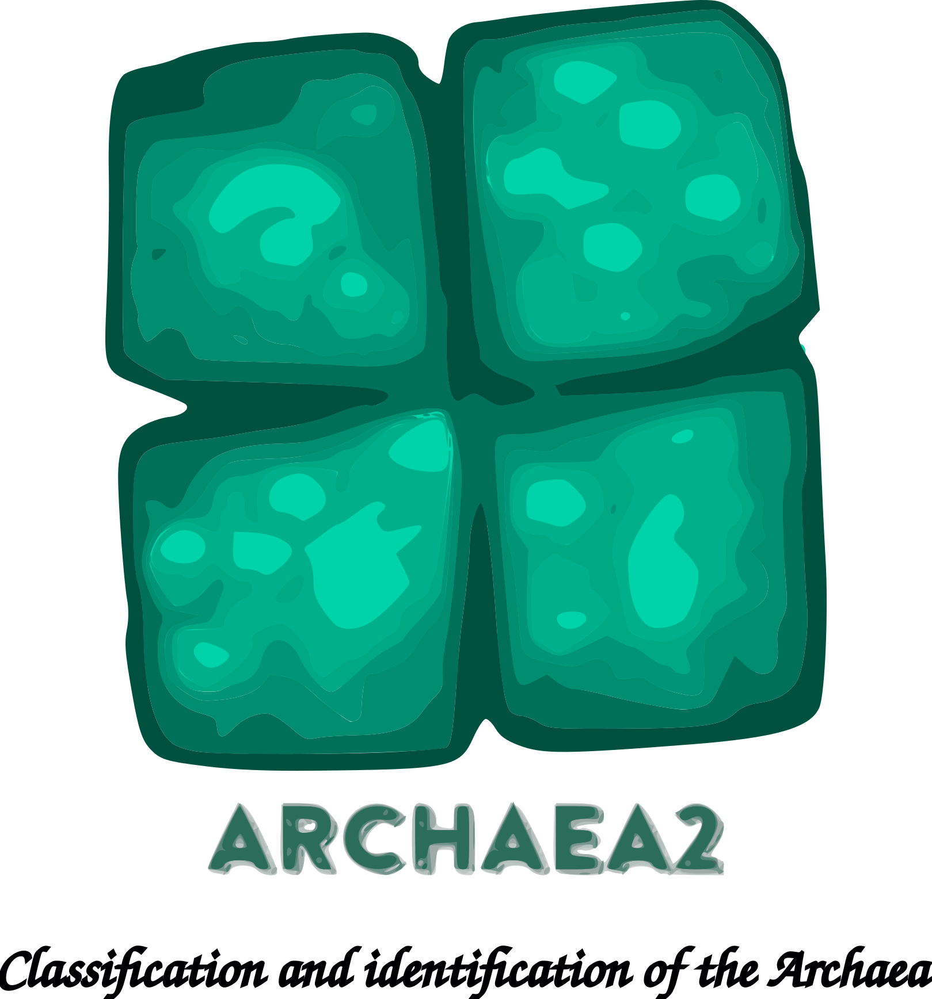

<p align="center">
</p>
<br>
<p align="center">
</p>

## Using Docker

```sh
git clone git@github.com:jorgeMFS/Archaea2.git
cd Archaea2
docker-compose build
docker-compose up -d && docker exec -it archaea2 bash && docker-compose down
```
## Install Tools
Get Archaea project using:
```bash
chmod +x run.sh
bash run.sh 
```


## Scripts

### Dataset Download: 
```bash
cd scripts || exit
bash download_dataset.sh
```
### Preprocess Dataset: 
```bash
cd scripts || exit
bash prepare_and_classify_dataset.sh
```
### Classification: 
```bash
cd "../python_src/" || exit
python3 create_classification_dataset.py
python3 classification.py
```
## Project structure
* */scripts*: bash scripts
* */python_src*: python3 scripts
* */reports*: extrated features from pre-processing dataset
* */taxonomic_info*: sample taxonomic description and mapping to taxonomic group  
* */data*: numpy data to perform classification
* */xlslist*: classification results.

## Requirements
- Ubunto 18.0 or higher
- Python3.6
- Anaconda
- or docker and docker-compose.
